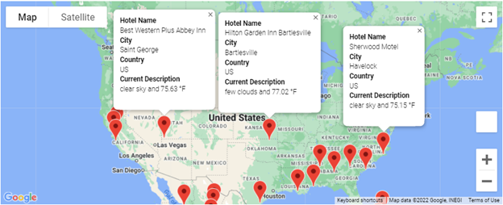
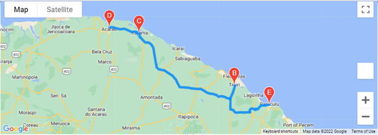
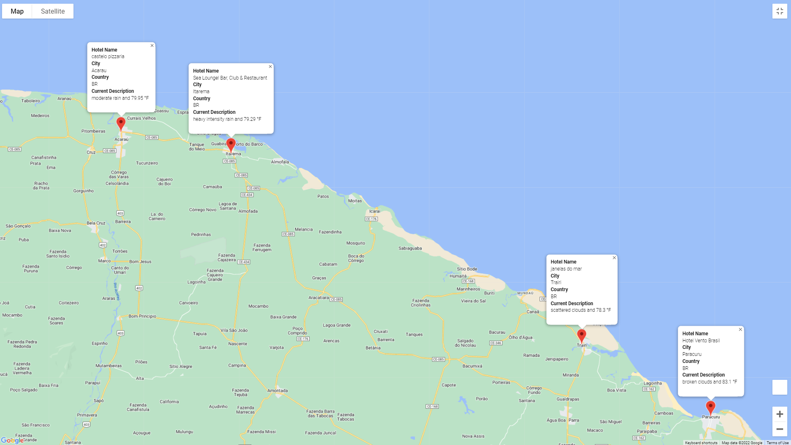

# world-weather-analysis
Analyzing and visualizing vacation destination options via Google API. 

## Overview
Based on client weather specifications, a prepared list of potential travel destinations will be narrowed down, producing a potential travel itinerary of four destinations. 

## Resources
Python 3.7.11
Jupyter Notebook
Google API
Open Weather Map API

## Results
### Vacation Search
#### Overall Vacation Map

### Vacation Itinerary
#### Route Map

#### Marked Cities

## Summary
The proposed trip would include these cities: 
- Paracuru, Brazil
- Trairi, Brazil
- Itarema, Brazil
- Acarau, Brazil
